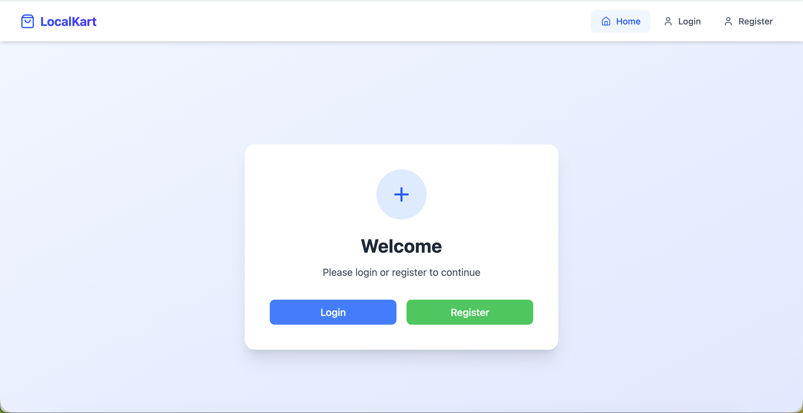
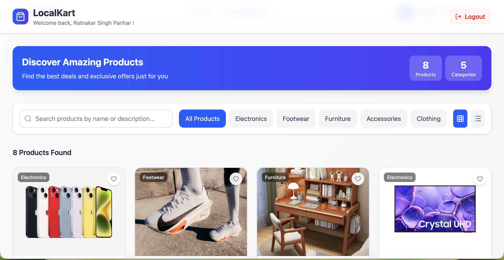
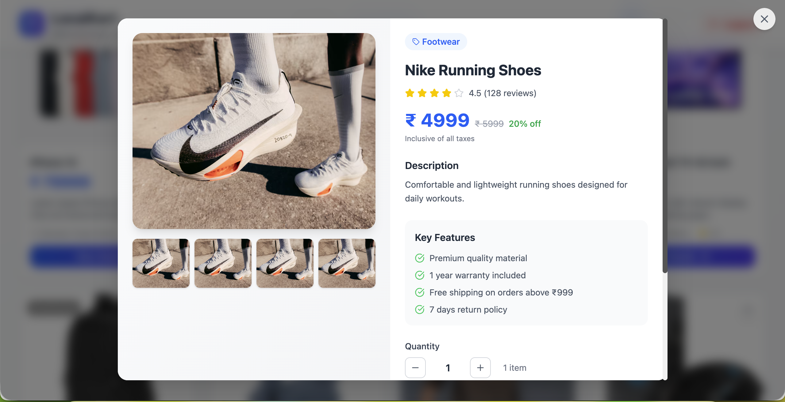
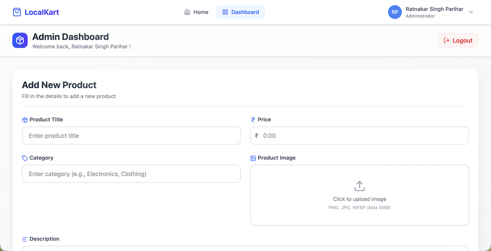
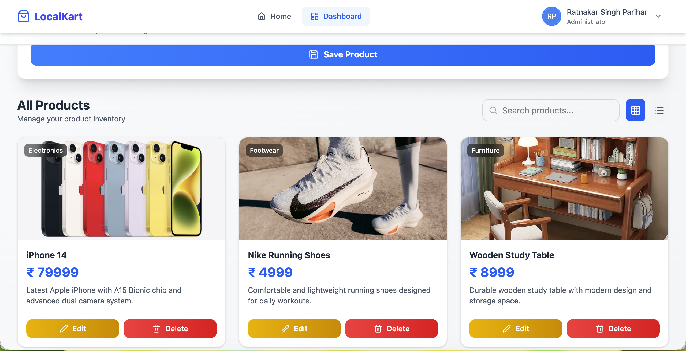

# 🛒 LocalKart – (MERN Stack)

🌟 A full-stack MERN application that enables users to explore and manage products from nearby businesses, with secure authentication and Cloudinary-based image uploads.

---

## 📌 Overview

LocalKart is a modern marketplace platform where users can browse products, and admins/vendors can manage product listings through a powerful dashboard. The application focuses on clean UI, scalable backend architecture, and real-world functionality.

---

## ✨ Key Features

### 👤 User Side

- Browse all available products
- View detailed product information
- Responsive and user-friendly interface

### 🛠 Admin / Vendor Dashboard

- Add new products
- Update existing products
- Delete products
- Upload and manage product images via Cloudinary
- Role-based access control (Admin/User)

---

## 🧰 Tech Stack

### 🔹 Frontend

- React.js
- Tailwind CSS
- Axios

### 🔹 Backend

- Node.js
- Express.js

### 🔹 Database

- MongoDB (Mongoose ODM)

### 🔹 Tools & Services

- Cloudinary (Image Upload & Storage)
- Multer (File handling middleware)
- JSON Web Token (JWT) – Authentication
- bcrypt.js – Password hashing

---

## 📁 Folder Structure

Task/
│
├── client/ # Frontend (React App)
│ ├── public/ # Static files
│ │
│ └── src/ # Source code
│ ├── assets/ # Images, icons, fonts
│ ├── components/ # Reusable UI components
│ ├── pages/ # Application pages (screens)
│ ├── services/ # API calls & business logic
│ │
│ ├── App.css # Global styles
│ ├── App.jsx # Root component
│ ├── index.jsx # Entry point
│ ├── main.jsx # App bootstrap
│ └── .env # Frontend environment variables
│
├── server/ # Backend (Express.js)
│ ├── config/ # Configuration (DB, Cloudinary)
│ ├── controllers/ # Business logic
│ ├── middleware/ # Auth & file upload middleware
│ ├── models/ # Mongoose schemas
│ ├── routes/ # API routes
│ │
│ ├── .env # Backend environment variables
│ └── server.js # Entry point of backend
│
└── README.md # Project documentation

---

## Installation & Setup

### 1 Clone Repository

```bash
git clone https://github.com/your-username/localkart.git
cd localkart
```

## Backend Setup

cd server
npm install

## Frontend Setup

cd client
npm install

### Environment Variables

PORT=8000
MONGO_URI=your_mongodb_connection_string
JWT_SECRET=your_jwt_secret

CLOUD_NAME=your_cloudinary_cloud_name
CLOUD_API_KEY=your_cloudinary_api_key
CLOUD_API_SECRET=your_cloudinary_api_secret

## Start Backend

npm run dev

## Start Frontend

npm run dev






